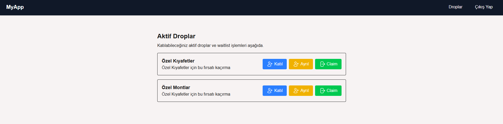
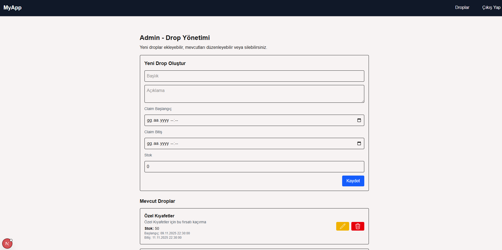
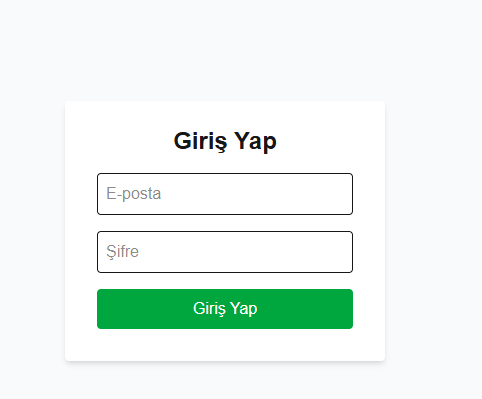
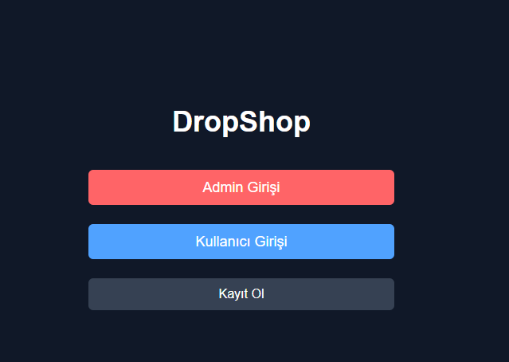
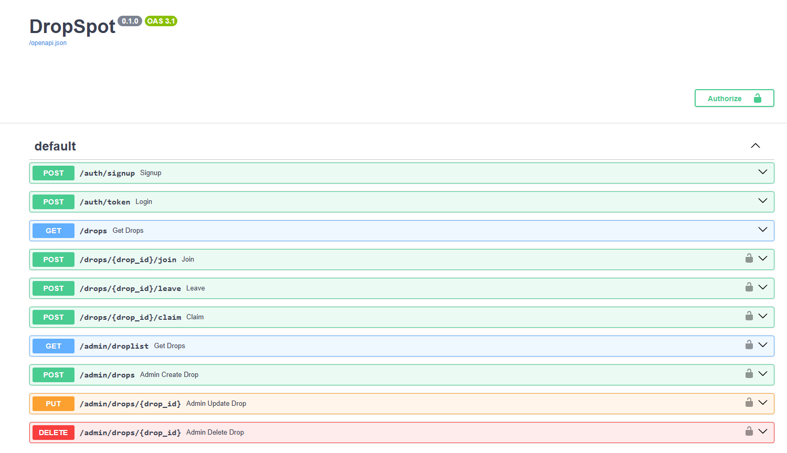

# DropSpot README 

# Başlangıç Tarihi(YYYYMMDDHHmm): 202511071914

## 1. Proje Özeti ve Mimari Açıklama

DropSpot; kullanıcıların konum bazlı drop etkinliklerine katılabildiği, admin paneli üzerinden içerik yönetiminin sağlandığı bir **FastAPI + Next.js** tabanlı tam yığın projedir. Backend katmanı REST mimarisine bağlı olarak modüler, servis odaklı ve idempotent işlem yapısına sahiptir. Frontend ise Next.js + Tailwind + shadcn/ui kullanılarak modern ve yeniden kullanılabilir bileşen yapısında geliştirilmiştir.

Uygulama mimarisi üç katmandan oluşur:

* **API Katmanı:** FastAPI ile oluşturulmuş, JWT tabanlı kimlik doğrulama ve admin yetkilendirme içerir.
* **Veri Erişim Katmanı:** SQLAlchemy ORM + SQLite (lokal geliştirme) kullanır. Tüm veri işlemleri `crud/` modülü üzerinden yönetilir.
* **Frontend Katmanı:** Next.js, axios, TailwindCSS bileşenleri ile oluşturulmuş yönetim ve kullanıcı arayüzleri.

---

## 2. Veri Modeli ve Endpoint Listesi

### Veri Modeli (SQLAlchemy)

**User**

* id: String (UUID)
* email: String
* password_hash: String
* is_admin: Boolean
* created_at: DateTime

**Drop**

* id: String (UUID)
* title: String
* description: String
* total_slots: Integer
* remaining_slots: Integer
* created_at: DateTime

**Waitlist**

* id: String (UUID)
* user_id: String (FK → users.id)
* drop_id: String (FK → drops.id)
* joined_at: DateTime
* priority_score: Integer
* claimed: Boolean
* UniqueConstraint(user_id, drop_id)

**Claim**

* id: String (UUID)
* user_id: String (FK → users.id)
* drop_id: String (FK → drops.id)
* claim_code: String (unique)
* created_at: DateTime

### Endpoint Listesi

#### Auth

* `POST /auth/signup` — Yeni kullanıcı kaydı
* `POST /auth/token` — Email + password ile JWT access token üretir

#### User

* `GET /drops` — Aktif drop listesini döner
* `POST /drops/{drop_id}/join` — Kullanıcıyı drop waitlist’ine ekler
* `POST /drops/{drop_id}/leave` — Kullanıcıyı waitlist’ten çıkarır
* `POST /drops/{drop_id}/claim` — Idempotent claim işlemi, claim_code üretir

#### Admin

* `GET /admin/droplist` — Tüm drop listesini döner
* `POST /admin/drops` — Yeni drop oluşturur
* `PUT /admin/drops/{drop_id}` — Var olan drop’ı günceller
* `DELETE /admin/drops/{drop_id}` — Drop’ı siler

---

## 3. CRUD Modülü Açıklaması

`crud/` klasörü, tüm veri işleme operasyonlarının **tek sorumlu katmanı** olarak çalışır. Avantajları:

* Transaction bütünlüğünü yönetir
* Tek noktadan veri doğrulama ve hata yönetimi sağlar
* API katmanının yalın kalmasını sağlar

Örnek fonksiyonlar:

* `create_drop(db, drop_in)`
* `list_all_drops(db)`
* `update_drop(db, drop_id, drop_in)`
* `delete_drop(db, drop_id)`

---

## 4. Idempotency Yaklaşımı ve Transaction Yapısı

Sistem özellikle **drop claim** işlemlerinde idempotent yaklaşım uygular:

* Aynı kullanıcı aynı drop için iki kez claim isteği gönderse bile tekrar slot düşmez.
* Transaction seviyesi: Bir claim işlemi sırasında slot düşülürken hata oluşursa işlem geri alınır (rollback).
* Tüm kritik işlemler `with db.begin():` blokları ile atomic şekilde çalışır.

---

## 5. Kurulum Adımları

### Backend

```bash
git clone <repo>
cd backend
python -m venv venv
source venv/bin/activate  # Windows: venv\Scripts\activate
pip install -r requirements.txt
uvicorn app.main:app --reload
```

### Frontend

```bash
cd frontend
npm install
npm run dev
```

---

## 6. Ekran Görüntüleri

### 1. Kullanıcı Drop Listesi Sayfası



*Mevcut drop'ların listelendiği ve katılım işleminin yapıldığı sayfa.*

### 2. Admin Drop Yönetimi



*Admin tarafından yeni drop ekleme, düzenleme ve silme fonksiyonlarının bulunduğu panel.*

### 3. Login Sayfası



*Kullanıcı girişi için JWT tabanlı kimlik doğrulama ekranı.*

### 4. Anasayfa



*Kullanıcı ve admini giriş ve kayıt olma ekranlarına yönlendirmek için açılış sayfası*

### 5. Api Arayüzü(Swagger)



*API endpointlerinin swagger arayüzü ile kullanımı*

---

## 7. Teknik Tercihler ve Kişisel Katkılar

* **FastAPI** tercih edilmesinin nedeni: yüksek performans, type-hint uyumu ve otomatik OpenAPI dokümantasyonu.
* **SQLAlchemy ORM** kullanımı: veri modelinde esneklik ve transaction kontrolü.
* **Next.js + Tailwind**: modern UI, hızlı prototipleme, yeniden kullanılabilir bileşen mimarisi.
* **Kişisel Katkılar:** API mimarisinin tasarlanması, tüm CRUD işlemlerinin implementasyonu, admin arayüzünün geliştirilmesi ve idempotent claim mekanizmasının yazılması.

---

## 8. Seed Üretim Yöntemi ve Projedeki Kullanımı

Proje içinde seed verisi üretilmesi için `seed.py` dosyası kullanıldı. Üretilen değer  root dizinindeki .env dosyasında mevcuttur.
```
seed = "7a53e0321fe0"
A = 5 + (int(seed[0:2], 16) % 4)
B = 10 + (int(seed[3:5], 16) % 6)
C = 2 + (int(seed[6:8], 16) % 3)

signup_latency_ms = (int(uuid.UUID(user.id)) * 101) % 1000
account_age_days = (datetime.utcnow() - user.created_at).days if user.created_at else 0
rapid_actions = db.query(models.Waitlist).filter_by(user_id=user.id).count()

base = 20 + (int(seed[-2:], 16) % 10)  # 20–30 arası değer gelicek
priority_score = base + ((account_age_days // A) + (signup_latency_ms % B)) + (rapid_actions * C)
priority_score = max(priority_score, 0)
```

Seed değeri yukarıdaki kod parçağında görüldüğü üzere kullanıcının waitlist yapması durumunda oluşan priority_score hesaplamasında kullanılmıştır. 

